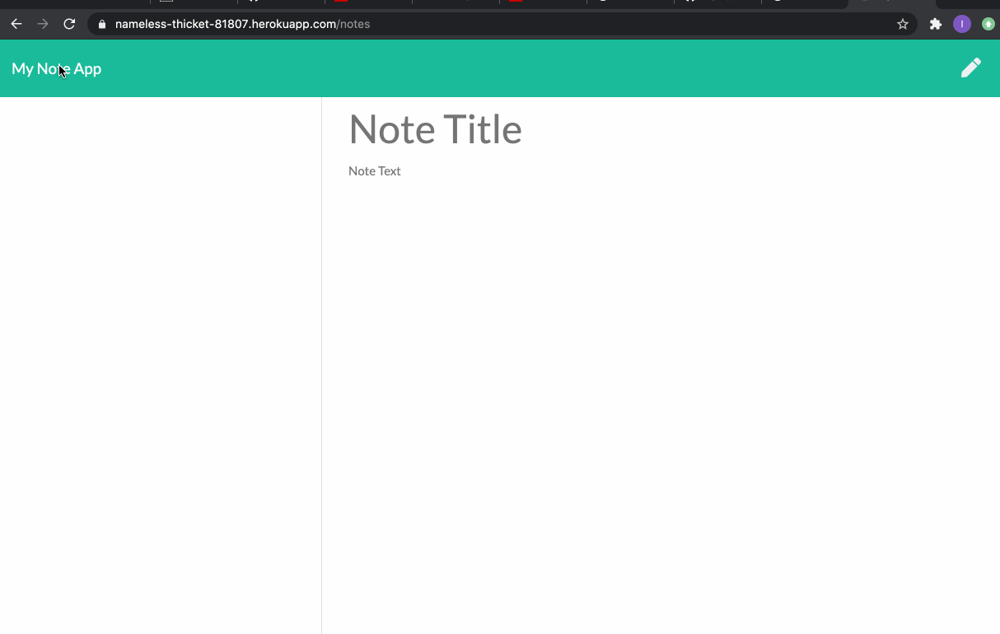

# Ivan's Note App


## Table of Contents
* [Description](#Description)
* [Technologies](#Technologies)
* [Features](#Features)
* [Author](#Author)
* [Credits](#Credits)
* [License](#License)

## Description 
Hi and welcome to my note taker app! This is app is specifically made to make and save notes for yourself. You will first be presented with a great looking home page, press the Get Started button in the container and you will be taken to a page where you have the ability to write a new note with a title. For your new note you can hit the save button to save the note and you will see it show up to the left of the page. You can delete existing notes by hitting the trash button to the right of the note. That pretty much sums up my app. Happy note taking! 


## Technologies
* [JavaScript](https://www.w3schools.com/js/)
* [FileSystem](https://nodejs.dev/learn/the-nodejs-fs-module)
* [Node.js](https://nodejs.org/en/)
* [Express](https://expressjs.com/)
* [uuid](https://www.npmjs.com/package/uuid)


## Features


* Here is my app.post. In here I take the note wich the user is wanting to write, give it a unique ID using uuid() function. Then I push to my jsonData which is acting as an array. THen I write to the my json file. 
```
app.post("/api/notes", function (req, res) {
  var newNote = req.body;
  // console.log(newNote);

  // Give each Item an unique ID
  newNote.id = uuidv4();

  // jsonData is acting as an array, so we are pushing to it. 
  jsonData.push(newNote);

  fs.writeFile("./db/db.json", JSON.stringify(jsonData), function finished(
    err
  ) {
    console.log("all set");
    res.json("Success!");
  });
});
  ```


* Here I ahve my app.delete. This is very similar to my app.post except instead of setting a new note I am requesting it and getting the id of it. Then I run a for loop to match the id of the note to the note array which is in jsonData. If the ID matches then you I use .splice to take that exact note and well "splice" it out. Last thing I do is write again to my JSON file but with my new filtered array. 

```
app.delete("/api/notes/:id", function (req, res) {
  // What ever the user chooses to delete, it will collect that ID.
  const id = req.params.id;

  for (i = 0; i < jsonData.length; i++) {
    if (jsonData[i].id === id) {
      jsonData.splice(i, 1);
    }
  }

  // Shortcut for above for loop
  //const filtered = jsonData.filter(note => note.id !== id);

  fs.writeFile("./db/db.json", JSON.stringify(jsonData), function finished(
    err
  ) {
    console.log("all set");
    res.json("Success!");
  });
});
```

## Author
Ivan Torres
* [GitHub-Repo](https://github.com/IvanTorresMia/ivans_notesApp)
* [Deployed-Link](https://nameless-thicket-81807.herokuapp.com/notes)
* [linkedIn](www.linkedin.com/in/ivan-torres-0828931b2)

## Credits
* Credits for this homework assignment go out to Jerome, Manuel, Kerwin, Roger, and all of my classmates who helped me in study sessions. As well as my tutor who helped me a ton with understanding this homework assignment. 
* [StackOverFlow](https://stackoverflow.com/)


## License]
[MIT](https://choosealicense.com/licenses/mit/#) license 